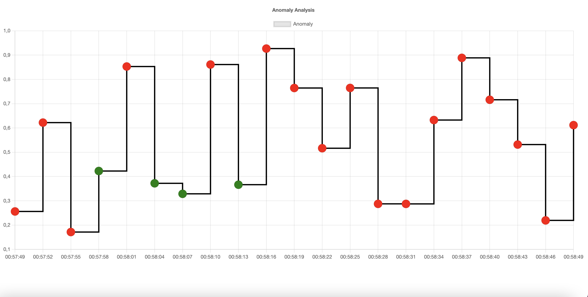

# Mqtt-App


## Setup

The first thing to do is to clone the repository:

```sh
$ git clone https://github.com/cagatay135/MqttApp.git
$ cd MqttApp
```

Create a virtual environment to install dependencies in and activate it:

```sh
$ virtualenv env
$ source env/bin/activate
```

Then install the dependencies:

```sh
(env)$ pip install -r requirements.txt
```

Once `pip` has finished downloading the dependencies:
```sh
(env)$ python manage.py runserver
```
And navigate to `http://127.0.0.1:8000/`

## Configration 
+ Set 'mqtt/.env' file with MQTT_HOST
+ Set 'static/config.js' file with MQTT_HOST and MQTT_PORT

## Usage
http://127.0.0.1:8000/mqtt : Listen and Analyzes topic data according to min and max value in settings.py file. Publishes to new topic to MQTT Broker

http://127.0.0.1:8000/chart : Listens to the published topic and visualizes with chart.js.

